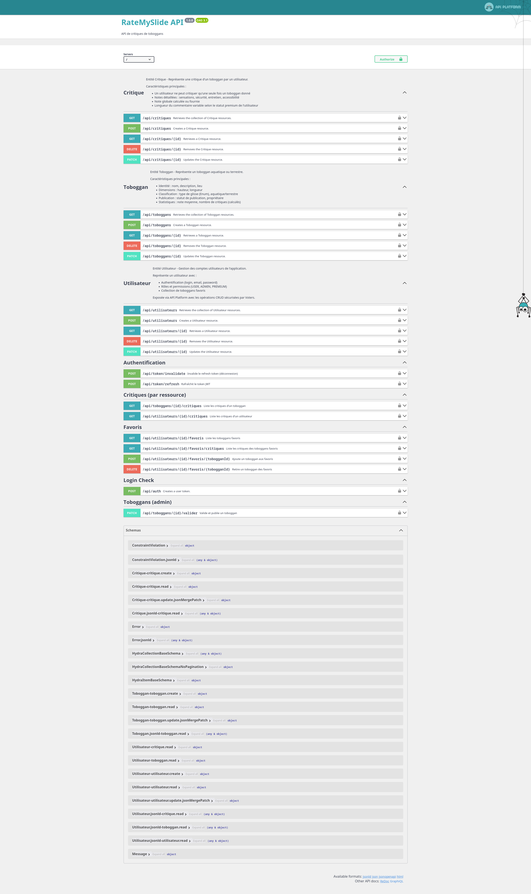

# RateMySlide - Application de critiques de toboggans

Application web de notation de toboggans aquatiques développée en binôme dans le cadre du BUT Informatique (Semestre 5). Un concept humoristique qui cache une architecture technique sérieuse et professionnelle.

## 🎯 Objectif

Développer une application web complète en suivant les bonnes pratiques de l'industrie : API REST avec Symfony et API Platform, frontend réactif avec Vue.js, authentification JWT sécurisée, et intégration de pratiques DevOps.

## 🎢 Contexte du projet

L'objectif pédagogique était de maîtriser le développement full-stack avec un framework PHP moderne couplé à un framework JavaScript réactif, tout en intégrant des pratiques DevOps et de qualité de code.

### Objectifs techniques
- Concevoir et implémenter une **API REST** respectant les standards
- Développer une **interface utilisateur** moderne et réactive
- Mettre en place un système d'**authentification sécurisé** (JWT)
- Appliquer les **bonnes pratiques** de développement (tests, analyse statique, CI/CD)
- Travailler en **équipe** avec un workflow Git professionnel

## 🛠️ Stack technique

| Couche | Technologies |
|--------|--------------|
| **Backend** | Symfony 6.4 LTS, API Platform 4.2, Doctrine ORM 3 |
| **Frontend** | Vue.js 3, Composition API |
| **Base de données** | MariaDB 10.5 |
| **Authentification** | JWT (Lexik JWT + Gesdinet Refresh Token) |
| **Qualité** | PHPStan (level 6), PHP CS Fixer, PHPUnit |
| **DevOps** | Docker, Docker Compose, SonarQube |

## 📖 Documentation API

L'API est entièrement documentée via Swagger UI, permettant de tester les endpoints directement depuis le navigateur.



## ⚡ Fonctionnalités implémentées

### Gestion des utilisateurs
- 👤 **Inscription** avec validation robuste du mot de passe (force, longueur)
- 🔐 **Authentification JWT** avec refresh token
- ⚙️ **Gestion du profil** utilisateur

### Gestion des toboggans
- 📝 **CRUD complet** avec système de brouillons/publication
- 🔍 **Filtres avancés** (lieu, type, hauteur, longueur)
- 📊 **Tri multi-critères**
- ⭐ **Système de favoris** personnalisé

### Système de critiques
- 💬 **Publication de critiques** sur les toboggans
- ⭐ **Notation et commentaires**
- 🔗 **Liaison automatique** avec l'auteur

### Sécurité
- 🛡️ **Rate limiting** sur l'authentification (protection anti-bruteforce)
- 🔒 **Voters Symfony** pour le contrôle d'accès granulaire
- 🔐 **Filtrage automatique** des données selon le contexte utilisateur

## 👨‍💻 Mon rôle et contributions

En binôme avec Quentin Grelier, j'ai principalement travaillé sur :

- **Architecture backend** : Mise en place de la structure API Platform avec les processors personnalisés
- **Système d'authentification** : Implémentation complète du flux JWT avec refresh tokens
- **Sécurité** : Développement du rate limiting et des voters d'autorisation
- **Qualité de code** : Configuration de PHPStan, mise en place des tests automatisés
- **Dockerisation** : Configuration de l'environnement de développement conteneurisé

## 📁 Architecture du projet

```
src/
├── Controller/          # Contrôleurs et traits réutilisables
├── Doctrine/Extension/  # Filtrage automatique des requêtes
├── Entity/              # Entités Doctrine avec traits
├── Enum/                # Énumérations PHP 8.1
├── EventSubscriber/     # Gestion des événements (rate limiting)
├── Repository/          # Couche d'accès aux données
├── Security/Voter/      # Contrôle d'accès granulaire
└── State/               # Processors API Platform
```

## 📊 Indicateurs de qualité

Le projet est suivi par SonarQube avec les métriques suivantes :

| Métrique | Statut |
|----------|--------|
| Quality Gate | ✅ Passed |
| Couverture de tests | Mesurée |
| Lignes dupliquées | Contrôlées |
| Hotspots de sécurité | Analysés |

## 🎓 Compétences développées

### Développement backend
- Maîtrise de **Symfony 6** et de son écosystème (Doctrine, Security, Events)
- Conception d'**API REST** avec API Platform
- Utilisation des **fonctionnalités PHP 8.1+** (Enums, Attributes, Traits)

### Sécurité applicative
- Implémentation de l'**authentification JWT**
- Protection contre les attaques par **force brute**
- Gestion fine des **autorisations** avec le pattern Voter

### DevOps et qualité
- Conteneurisation avec **Docker**
- Analyse statique avec **PHPStan**
- Intégration continue avec **SonarQube**
- Tests automatisés avec **PHPUnit**

### Travail collaboratif
- Utilisation de **Git** en équipe (branches, pull requests, code review)
- Documentation technique (README, OpenAPI)

---

*RateMySlide m'a permis de consolider mes compétences en développement web full-stack tout en découvrant des pratiques professionnelles essentielles : architecture logicielle propre, sécurité applicative, et intégration continue.*
