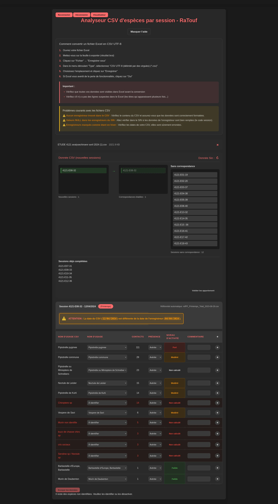


**RaTouf** is a specialized application for integrating and analyzing data from bat ultrasonic recordings to optimize validation and transmission processes to ECO-MED's SIN.


# RaTouf - Chiroptera Data Analysis

Specialized application for integrating and analyzing data from bat ultrasonic recordings to optimize validation and transmission processes to ECO-MED's SIN.

## 🎯 Objective

RaTouf facilitates the transfer of chiroptera acoustic data from SonoChiro to ECO-MED's Naturalist Information System (SIN). The application automates species identification validation and calculates activity levels according to scientific references.

## 🔍 Problem Solved

Before RaTouf, chiropterological data integration was entirely manual:
- Tedious import of SonoChiro CSV files
- Individual validation of thousands of identifications
- Manual activity level calculations
- Transcription error risks
- Considerable processing time for experts

## ⚡ Main Features

### Smart Import and Parsing
- **Automatic analysis** of SonoChiro CSV files
- **Adaptive detection** of formats and structural variations
- **Robust handling** of missing or inconsistent data
- **Data preview** before processing

### Assisted Scientific Validation
- **Taxonomic correspondence** with TAXREF reference
- **Phonic group management** (acoustically similar species)
- **Intuitive validation interface** for experts
- **Automatic flagging** of doubtful identifications

### Automatic Activity Level Calculation
- **Multi-reference algorithms** (Barataud, TeamChiro, etc.)
- **Contextual adaptation** according to season and habitat
- **Automatic classification**: Low, Moderate, High, Very High
- **Traceability** of calculation methods used

### SIN Integration
- **Direct communication** with SIN's ArcGIS API
- **Retrieval of existing** recording sessions
- **Duplicate avoidance** through intelligent matching
- **Secure transmission** of validated data

## 🖼️ User Interface

### Main Analysis Screen

RaTouf's interface clearly presents:
- Recording sessions to process
- SIN correspondence status
- Detailed data per species
- Calculated activity levels

### Taxonomic Visualizer

Advanced tool for navigating chiroptera taxonomy, allowing exploration of relationships between species and phonic groups.

### Session Correspondence Management

Interface for matching SonoChiro sessions with SIN sessions, with exception case management.

### Identification Details

#### Species Found in SIN

Detailed view for species already present in SIN, with data comparison.

#### New Identifications

Interface for processing new identifications not present in SIN.

## 🛠️ Technical Architecture

### Technology Stack
- **Frontend**: Vanilla JavaScript, HTML5, CSS3
- **Backend**: Node.js, Express.js
- **Integration**: ArcGIS REST API, SonoChiro CSV
- **Database**: MongoDB (via ECO-MED Hub)
- **Authentication**: JWT integrated with Azure AD

### Specialized Services

#### ChiroptereService
- Chiroptera taxonomic data management
- Correspondence between phonic codes and CD_NOM
- Species identification validation

#### ActivityLevelCalculator
- Implementation of activity calculation algorithms
- Multi-reference support (Barataud, TeamChiro, etc.)
- Contextual adaptation according to season and habitat

#### DataProcessor
- Robust parsing of SonoChiro CSV files
- Imported data cleaning and validation
- Automatic anomaly detection

#### SessionValidator
- Correspondence between SonoChiro and SIN sessions
- Temporal and geographical consistency validation
- Exception case management

## 🔬 Scientific Innovation

### Phonic Group Management
RaTouf innovates in managing **acoustically similar species groups**. Unlike traditional taxonomic approaches, the application recognizes that certain species (e.g., Cryptic Myotis/Escalera's Myotis) cannot be differentiated by their ultrasonic emissions.

### Adaptive Activity Algorithms
The application implements **contextual algorithms** that adapt activity thresholds according to:
- Time of year (reproduction, migration, hibernation)
- Habitat type (forest, prairie, wetland)
- Weather conditions
- Recording method used

## 📊 Results and Impact

### Operational Gains
- ⏱️ **90%** reduction in data processing time
- 🎯 **95%** reliability in validated identifications
- 📈 **100%** automation of activity calculations
- 🔄 **Elimination** of manual transcription errors

### Regulatory Compliance
- ✅ **Automated transmission** to INPN via SIN
- ✅ **Compliance with** SINP and TAXREF standards
- ✅ **Complete traceability** of data and processing
- ✅ **Scientific validation** by experts

## 🎓 Skills Developed

### Technical
- Complex data parsing and validation
- Acoustic analysis algorithms
- Third-party API integration (ArcGIS)
- Taxonomic data management
- Performance optimization

### Business
- Applied chiropterology expertise
- Knowledge of activity references
- Understanding of conservation issues
- Scientific validation processes

---

*RaTouf represents a major innovation in chiropterological data processing, combining scientific expertise with advanced technical solutions to optimize ECO-MED's processes and contribute to better knowledge of bat populations.*