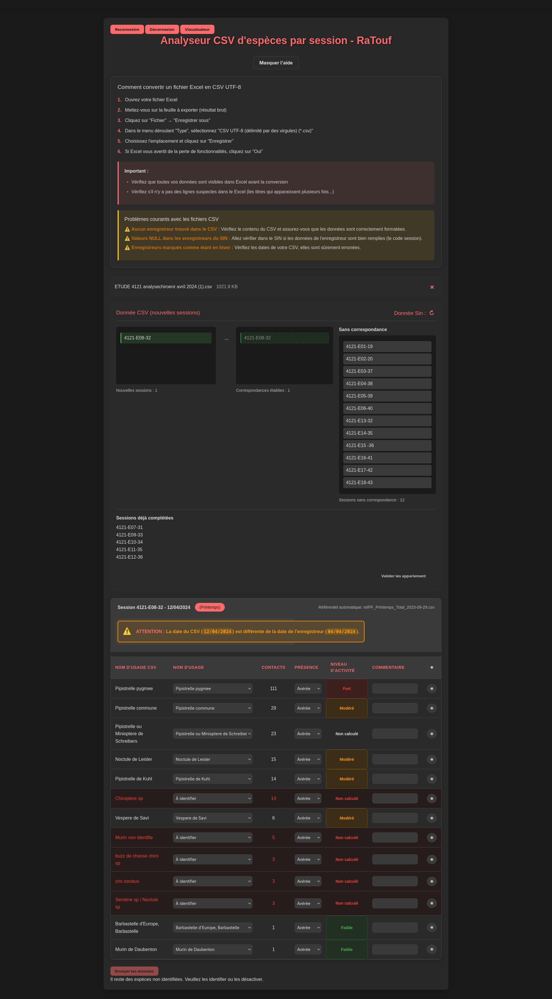


**RaTouf** est une application spécialisée dans l'intégration et l'analyse des données issues des enregistrements ultrasonores de chauves-souris pour optimiser les processus de validation et de transmission au SIN d'ECO-MED.


# RaTouf - Analyse des Données Chiroptères

Application spécialisée dans l'intégration et l'analyse des données issues des enregistrements ultrasonores de chauves-souris pour optimiser les processus de validation et de transmission au SIN d'ECO-MED.

## 🎯 Objectif

RaTouf facilite le transfert des données acoustiques de chiroptères depuis SonoChiro vers le Système d'Information Naturaliste (SIN) d'ECO-MED. L'application automatise la validation des identifications d'espèces et calcule les niveaux d'activité selon les référentiels scientifiques.

## 🔍 Problématique résolue

Avant RaTouf, l'intégration des données chiroptérologiques était entièrement manuelle :
- Import fastidieux des fichiers CSV SonoChiro
- Validation individuelle de milliers d'identifications
- Calculs manuels des niveaux d'activité
- Risques d'erreurs lors de la transcription
- Temps de traitement considérable pour les experts

## ⚡ Fonctionnalités principales

### Import et parsing intelligent
- **Analyse automatique** des fichiers CSV SonoChiro
- **Détection adaptative** des formats et variations de structure
- **Gestion robuste** des données manquantes ou incohérentes
- **Prévisualisation** des données avant traitement

### Validation scientifique assistée
- **Correspondance taxonomique** avec le référentiel TAXREF
- **Gestion des groupes phoniques** (espèces acoustiquement similaires)
- **Interface de validation** intuitive pour les experts
- **Signalement automatique** des identifications douteuses

### Calcul automatique des niveaux d'activité
- **Algorithmes multi-référentiels** (Barataud, TeamChiro, etc.)
- **Adaptation contextuelle** selon la saison et l'habitat
- **Classification automatique** : Faible, Modéré, Fort, Très Fort
- **Traçabilité** des méthodes de calcul utilisées

### Intégration SIN
- **Communication directe** avec l'API ArcGIS du SIN
- **Récupération des sessions** d'enregistrement existantes
- **Évitement des doublons** par correspondance intelligente
- **Transmission sécurisée** des données validées

## 🖼️ Interface utilisateur

### Écran principal d'analyse

L'interface de RaTouf présente de manière claire :
- Les sessions d'enregistrement à traiter
- L'état de correspondance avec le SIN
- Les données détaillées par espèce
- Les niveaux d'activité calculés

### Visualisateur taxonomique

Outil avancé de navigation dans la taxonomie des chiroptères permettant d'explorer les relations entre espèces et groupes phoniques.

### Gestion des correspondances de sessions

Interface de correspondance entre les sessions SonoChiro et celles du SIN, avec gestion des cas d'exception.

### Détails des identifications

#### Espèces trouvées dans le SIN

Vue détaillée pour les espèces déjà présentes dans le SIN, avec comparaison des données.

#### Nouvelles identifications

Interface pour traiter les nouvelles identifications non présentes dans le SIN.

## 🛠️ Architecture technique

### Stack technologique
- **Frontend** : JavaScript vanilla, HTML5, CSS3
- **Backend** : Node.js, Express.js
- **Intégration** : API REST ArcGIS, SonoChiro CSV
- **Base de données** : MongoDB (via Hub ECO-MED)
- **Authentification** : JWT intégré avec Azure AD

### Services spécialisés

#### ChiroptereService
- Gestion des données taxonomiques des chiroptères
- Correspondance entre codes phoniques et CD_NOM
- Validation des identifications d'espèces

#### ActivityLevelCalculator
- Implémentation des algorithmes de calcul d'activité
- Support multi-référentiels (Barataud, TeamChiro, etc.)
- Adaptation contextuelle selon la saison et l'habitat

#### DataProcessor
- Parsing robuste des fichiers CSV SonoChiro
- Nettoyage et validation des données importées
- Détection automatique des anomalies

#### SessionValidator
- Correspondance entre sessions SonoChiro et SIN
- Validation de la cohérence temporelle et géographique
- Gestion des cas d'exception

## 🔬 Innovation scientifique

### Gestion des groupes phoniques
RaTouf innove dans la gestion des **groupes d'espèces acoustiquement similaires**. Contrairement aux approches taxonomiques traditionnelles, l'application reconnaît que certaines espèces (ex: Murin cryptique/Murin d'Escalera) ne peuvent être différenciées par leurs émissions ultrasonores.

### Algorithmes d'activité adaptatifs
L'application implémente des **algorithmes contextuels** qui adaptent les seuils d'activité selon :
- La période de l'année (reproduction, migration, hibernation)
- Le type d'habitat (forêt, prairie, zone humide)
- Les conditions météorologiques
- La méthode d'enregistrement utilisée

## 📊 Résultats et impact

### Gains opérationnels
- ⏱️ **90%** de réduction du temps de traitement des données
- 🎯 **95%** de fiabilité dans les identifications validées
- 📈 **100%** d'automatisation des calculs d'activité
- 🔄 **Élimination** des erreurs de transcription manuelle

### Conformité réglementaire
- ✅ **Transmission automatisée** vers l'INPN via le SIN
- ✅ **Respect des standards** SINP et TAXREF
- ✅ **Traçabilité complète** des données et traitements
- ✅ **Validation scientifique** par les experts

## 🎓 Compétences développées

### Techniques
- Parsing et validation de données complexes
- Algorithmes d'analyse acoustique
- Intégration d'APIs tierces (ArcGIS)
- Gestion de données taxonomiques
- Optimisation de performances

### Métier
- Expertise en chiroptérologie appliquée
- Connaissance des référentiels d'activité
- Compréhension des enjeux de conservation
- Processus de validation scientifique

---

*RaTouf représente une innovation majeure dans le traitement des données chiroptérologiques, combinant expertise scientifique et solutions techniques avancées pour optimiser les processus d'ECO-MED et contribuer à une meilleure connaissance des populations de chauves-souris.*