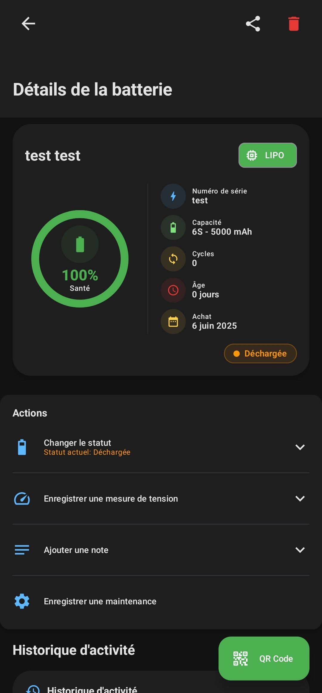
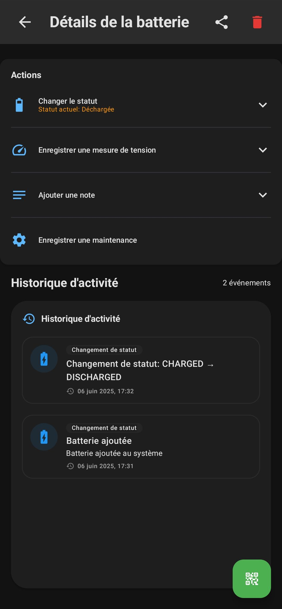


**SkyFuel** est une application Android dédiée à la gestion efficace des batteries de drone, permettant aux pilotes et aux opérateurs de maintenir leurs batteries en bon état et d'optimiser leur durée de vie.



Version 1.0.0


Android App


Open Source






## Fonctionnalités Principales

### 1. Gestion des Batteries

- **Enregistrement de batteries** : Ajoutez facilement de nouvelles batteries à votre inventaire en spécifiant:
  - Marque et modèle
  - Nombre de cellules
  - Capacité (mAh)
  - Type (LiPo, Li-ion, etc.)
  - Date d'achat
  - Numéro de série
  - Notes personnalisées

- **Dashboard principal** : Visualisez d'un coup d'œil toutes vos batteries et leur état actuel.


  
  


- **Filtrage et recherche** : Retrouvez rapidement une batterie spécifique par statut, modèle, ou autres critères.

### 2. Suivi d'État et Gestion du Cycle de Vie

- **Statuts multiples** :
  - Chargée (prête à l'emploi)
  - Déchargée (nécessite une charge)
  - En stockage (niveau de charge optimal pour stockage à long terme)
  - Hors service (batterie à recycler)

- **Enregistrement du voltage** : Documentez les niveaux de tension à différentes étapes pour suivre la santé de la batterie.

- **Compteur de cycles** : Suivi automatique du nombre de cycles charge/décharge pour chaque batterie.

- **Historique d'utilisation** : Consultez l'historique complet des changements d'état et d'utilisation.

- **Estimation de durée de vie** : Calcul de la durée de vie restante basé sur le nombre de cycles et les performances.

### 3. Système de QR Codes

- **Génération de QR codes uniques** : Création automatique d'un QR code pour chaque batterie enregistrée.

- **Impression facile** : Exportation des QR codes dans des formats optimisés pour l'impression sur étiquettes résistantes.

- **Accès rapide** : Le scan d'un QR code dirige instantanément vers la page de la batterie correspondante.

- **Modification d'état express** : Changez rapidement le statut d'une batterie après avoir scanné son QR code.



### 4. Système d'Alertes et Rappels

- **Notifications de charge prolongée** : Alertes pour les batteries restées en charge trop longtemps.

- **Alertes de décharge prolongée** : Rappels pour les batteries laissées déchargées, ce qui peut les endommager.

- **Rappels de stockage** : Notifications pour préparer les batteries au stockage longue durée si inutilisées.

- **Alertes de fin de vie** : Notifications lorsqu'une batterie approche de sa fin de vie théorique basée sur les cycles.

### 5. Statistiques et Rapports

- **Tableau de bord analytique** : Visualisez les tendances d'utilisation et l'état global de votre flotte de batteries.

- **Rapports de santé** : Générez des rapports détaillés sur la santé et les performances de chaque batterie.

- **Statistiques d'utilisation** : Suivez quelles batteries sont les plus utilisées et lesquelles pourraient être sous-utilisées.

- **Export de données** : Exportez vos données dans différents formats (CSV, PDF) pour analyse externe.

## Spécifications Techniques

- **Plateformes** : Application disponible sur Android
- **Stockage** : Stockage local des données avec option de synchronisation cloud
- **Performance** : Faible consommation de ressources, optimisée pour une utilisation sur le terrain
- **Connectivité** : Mode hors-ligne disponible avec synchronisation automatique

## Avantages

- Prolongez la durée de vie de vos batteries en suivant les meilleures pratiques de charge et de stockage
- Évitez les pannes en vol grâce à une meilleure gestion de l'état des batteries
- Réduisez les coûts en maximisant la durée de vie de chaque batterie
- Gagnez du temps avec un système d'identification rapide par QR code
- Améliorez la sécurité en identifiant les batteries potentiellement défectueuses

## Public Cible

- Pilotes de drone professionnels
- Sociétés de production vidéo par drone
- Services d'inspection par drone
- Entreprises de cartographie aérienne
- Amateurs possédant plusieurs drones et batteries


**Téléchargez SkyFuel v1.0.0** sur [GitHub](https://github.com/Pixnop/SkyFuel)



 Android 
 Kotlin 
 QR Code 
 Gestion batteries 
